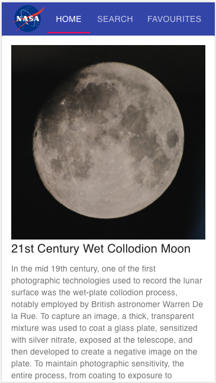
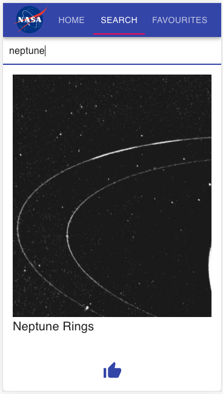
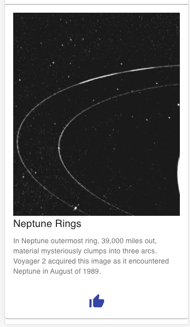
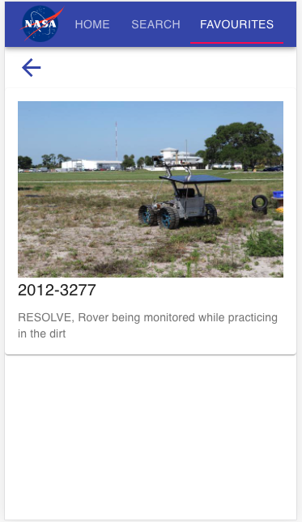
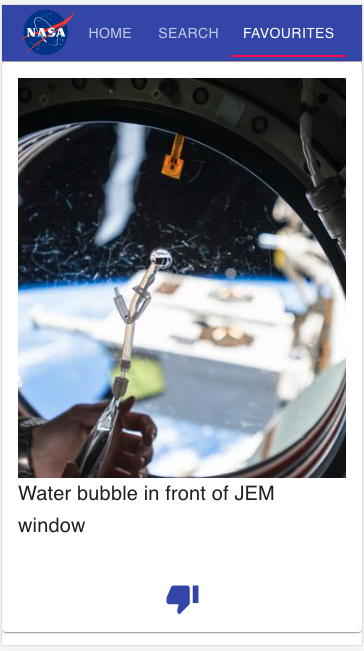

# Getting Started with Bank App (MERN application)

This project was bootstrapped with [Create React App](https://github.com/facebook/create-react-app).

## Available Scripts

In the project directory, you can run:

### `npm start`
### `node server`

Runs the app in the development mode.\
Open [http://localhost:3000](http://localhost:3000) to view it in the browser.

Server will run on port 3001

Compatible with both phone and computer

frontend - react,axios and material-ui

server - express and mongoose

database - mongoDB

  
 
